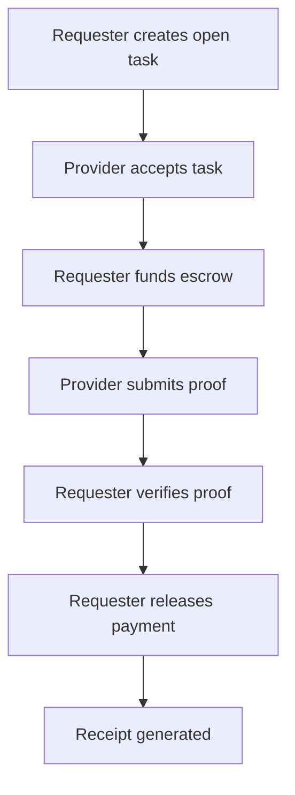
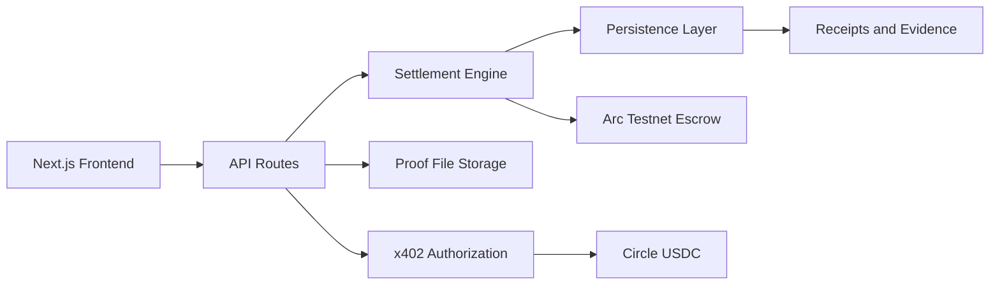

# ProoVra


Proof-Gated Settlement Infrastructure for Verified Digital Work

ProoVra is proof-gated settlement infrastructure for verified digital work and agent commerce. A requester creates an open task, funds escrow, a provider submits proof, the requester verifies completion, and payment is released only after the proof is accepted. The current implementation is validated on Arc Testnet and persists agents, tasks, settlements, proof evidence, x402 payment records, and receipts.

## Why ProoVra?

Most payment systems answer one question:

**How do funds move?**

ProoVra answers a different one:

**When should funds move?**

As AI agents, open-source communities, creator platforms, and distributed teams coordinate work online, payment increasingly depends on verifiable proof rather than trust alone.

ProoVra provides reusable proof-gated settlement infrastructure that combines escrow, proof submission, verification, payment release, and receipt generation into one deterministic settlement pipeline.

The current implementation demonstrates this through open-source contributor settlements, while the same settlement engine extends to creator campaigns, AI agent tasks, research reviews, security audits, documentation bounties, and community moderation.

## Table of Contents

- [Problem Statement](#problem-statement)
- [Architecture Overview](#architecture-overview)
- [Core Capabilities](#core-capabilities)
- [Settlement Profiles](#settlement-profiles)
- [Reference Workflow](#reference-workflow)
- [Arc Testnet Settlement](#arc-testnet-settlement)
- [Circle USDC and x402](#circle-usdc-and-x402)
- [Repository Structure](#repository-structure)
- [Local Development](#local-development)
- [Vercel Persistence](#vercel-persistence)
- [Design Principles](#design-principles)
- [Future Directions](#future-directions)
- [Project Status](#project-status)
- [README Changes](#readme-changes)

## Problem Statement

Digital work often depends on claims that are hard to evaluate at payment time. A contributor says a pull request is ready. A researcher says a summary is complete. An agent says a task was executed. A moderator says an action was handled. Payment should not move solely because completion is claimed.

ProoVra treats proof, verification, and settlement state as first-class infrastructure:

- Proof records what was submitted.
- Verification records who approved the work and when.
- Escrow state records whether funds are locked, released, refunded, or failed.
- Receipts preserve the task, wallets, proof, transaction hashes, and settlement metadata.

The result is a reusable proof-to-payment primitive for workflows where trust depends on verifiable completion.

## Architecture Overview

### Settlement Flow



### System Architecture



ProoVra separates workflow presentation from settlement execution. The frontend guides users through task creation, provider acceptance, proof submission, verification, and release. The settlement engine maintains state transitions and records evidence. Arc Testnet validates escrow and release behavior. Circle and x402 provide the payment authorization path used by the protected proof service.

## Core Capabilities

| Capability | Current implementation |
| --- | --- |
| Requester registration | Requester agents can be registered from a connected wallet. |
| Provider identity | Provider participants attach when a different wallet accepts an open task. |
| Professional roles | Agents can be described with roles such as Developer, Researcher, Writer, Designer, Security, or Agent Operator. |
| Settlement Profiles | Frontend presets for common proof-gated workflows. |
| Open task creation | Requesters create open tasks without pre-selecting a provider. |
| Task acceptance | A provider wallet can accept an open task if it is different from the requester wallet. |
| Escrow funding | Requesters fund escrow through wallet-signed Arc Testnet transactions. |
| Proof submission | Providers can submit text, URLs, proof hashes, and uploaded files. |
| Verification | Requesters explicitly approve submitted proof before release. |
| Payment release | Funds release from escrow after verification. |
| Receipts | Receipts include settlement metadata, proof references, and transaction evidence. |
| Persistence | App records are persisted through local storage in development and Vercel storage in deployment. |
| x402 | Protected proof endpoint supports payment-gated authorization behavior. |

## Settlement Profiles

Settlement Profiles are frontend workflow presets. They prefill task creation fields such as suggested title, proof requirements, verification checklist, requester role, provider role, and receipt label.

Profiles do not change backend settlement logic. Every profile uses the same deterministic settlement engine:

```text
Requester creates task
Provider accepts task
Requester funds escrow
Provider submits proof
Requester verifies proof
Requester releases payment
Receipt is generated
```

| Profile | Description |
| --- | --- |
| Open-source Contribution | Maintainers pay contributors for verified repository work such as PRs, commits, documentation, or issue fixes. |
| Creator Campaign | Coordinators release campaign payment after content links, screenshots, or delivery evidence are reviewed. |
| AI Agent Task | Agent operators submit output, run logs, result links, or execution evidence for review. |
| Research Review | Researchers submit findings, source links, citations, or written summaries. |
| Security Audit | Auditors submit issue lists, reproduction steps, review notes, or audit reports. |
| Documentation Bounty | Writers submit documentation PRs, documents, screenshots, or committed updates. |
| Community Moderation | Moderators submit action logs, summaries, screenshots, or moderation evidence. |

## Reference Workflow

### Open-source contributor settlement

1. A maintainer connects a wallet and registers a requester agent.
2. The maintainer selects the Open-source Contribution profile.
3. ProoVra pre-fills a task such as `Fix documentation issue and submit PR proof`.
4. The maintainer creates the open task with a USDC amount and proof requirement.
5. A contributor connects a different wallet and accepts the task.
6. The maintainer funds escrow on Arc Testnet.
7. The contributor submits proof, such as a GitHub PR link, commit hash, screenshot, document, or summary.
8. The maintainer reviews the proof and verifies completion.
9. The maintainer releases payment from escrow.
10. ProoVra generates a receipt containing the task ID, requester, provider, proof evidence, verification timestamp, escrow transaction, release transaction, and settlement metadata.

## Arc Testnet Settlement

ProoVra has completed controlled end-to-end settlement validation on Arc Testnet using the deployed `SettlementEscrow` contract.

- Contract: `0x38D7C4cC9C108D127923651ced41bdb123Dbc611`
- Network: Arc Testnet
- Chain ID: `5042002`
- Token: `0x3600000000000000000000000000000000000000`
- Verified flow: Approve -> CreateEscrow -> ReleaseAfterProof
- Example escrow ID: `2`
- Example amount: `0.000001 USDC`
- Example result: proof successfully triggered payment release.

Verification transactions:

- Approval: [`0x78e3dc44dde9922987ba67609265832732aa8d07b1552273c9c8f960fb80bc59`](https://testnet.arcscan.app/tx/0x78e3dc44dde9922987ba67609265832732aa8d07b1552273c9c8f960fb80bc59)
- CreateEscrow: [`0x3bb97f592f0bed6327c230bfad3d318c004d4eef3c463cdaad457f5477eeb130`](https://testnet.arcscan.app/tx/0x3bb97f592f0bed6327c230bfad3d318c004d4eef3c463cdaad457f5477eeb130)
- ReleaseAfterProof: [`0xb6babd7af10ca13e095f5b77a6652e72c4dc16129e0ba848f33b92fac482e036`](https://testnet.arcscan.app/tx/0xb6babd7af10ca13e095f5b77a6652e72c4dc16129e0ba848f33b92fac482e036)

Full evidence report: [`ARC_TESTNET_VERIFICATION_REPORT.md`](ARC_TESTNET_VERIFICATION_REPORT.md)

## Circle USDC and x402

ProoVra includes an x402-compatible protected proof endpoint and Circle CLI x402 provider boundaries. The endpoint fails closed for unpaid or invalid requests, and Circle Gateway/x402 authorization has been verified in the project evidence.

- Protected endpoint: `GET /api/x402/protected-proof`
- Authorization route: `POST /api/x402/authorize`
- Provider mode: `circle-cli-x402`
- Scheme: `GatewayWalletBatched`
- Network: Arc Testnet, `eip155:5042002`
- Asset: `0x3600000000000000000000000000000000000000`
- Verified behavior: unpaid requests return `402`; authorized paid requests return protected proof data and persisted payment evidence.

## Repository Structure

```text
proovra/
  contracts/                     Solidity escrow contract
  deployments/                   Arc Testnet deployment metadata
  public/                        Static assets and brand files
  script/                        Foundry deployment scripts
  scripts/                       Local utility and verification scripts
  src/
    app/                         Next.js routes and API endpoints
      (app)/                     Product pages
      api/                       API routes for agents, tasks, settlements, receipts, proof files, x402
    components/                  Shared UI components
    hooks/                       Client hooks
    integrations/                Arc, Circle, x402, and provider integrations
    lib/                         Persistence, formatting, wallet validation, shared types
    providers/                   Settlement and wallet provider boundaries
    services/                    Task, agent, escrow, verification, receipt, and settlement services
  ARC_DEPLOYMENT.md              Arc deployment notes
  ARC_TESTNET_SETUP.md           Arc Testnet setup guide
  ARC_TESTNET_VERIFICATION_REPORT.md
  DEMO.md                        Demo flow notes
  README.md
  SUBMISSION.md
```

## Local Development

Install dependencies:

```bash
npm install
```

Run the development server:

```bash
npm run dev
```

Open:

```text
http://localhost:3000
```

Run quality checks before handing off code changes:

```bash
npx tsc --noEmit
npm run lint
npm run build
npm run lepton:tooling
```

### Arc CLI

```bash
uv tool install git+https://github.com/the-canteen-dev/ARC-cli
```

The Arc CLI is used for Arc testnet setup context, documentation, and developer workflow alignment.

### Circle CLI

```bash
npm install -g @circle-fin/cli
```

The Circle CLI supports Circle wallet and x402-related workflows used by ProoVra's payment authorization path.

## Vercel Persistence

Production deployments must use durable storage because Vercel serverless filesystems are read-only at runtime.

Required Vercel environment variables:

- `KV_REST_API_URL`
- `KV_REST_API_TOKEN`
- `BLOB_READ_WRITE_TOKEN`

Optional:

- `PROOVRA_KV_DB_KEY` to override the Vercel KV key used for the app database. Default: `proovra:database:v3`.
- `PROOVRA_BLOB_ACCESS` can be set to `public` only when the connected Blob store allows public uploads. Private Blob stores work by default.

Local development uses `data/proovra-db.json` and local proof upload paths when production storage variables are not set.

## Design Principles

- Payment follows verified proof: funds should move only after submitted evidence is reviewed and accepted.
- Deterministic settlement: task, escrow, proof, verification, release, and receipt states should be explicit.
- Reusable settlement primitives: the same engine should support many verified-work workflows.
- Infrastructure over workflows: profiles guide task creation, but settlement behavior remains consistent.
- Role separation: the requester funds and approves; the provider performs work and submits proof.
- Evidence persistence: receipts should preserve proof references and transaction metadata.

## Future Directions

Near-term roadmap:

- Improve production observability for settlement and proof upload failures.
- Add clearer reviewer-facing receipt export formats.
- Expand profile-specific task templates while preserving the same settlement engine.
- Continue hardening Arc Testnet release diagnostics.
- Improve evidence access controls for private proof files.

Not currently claimed:

- Mainnet settlement.
- Production financial guarantees.
- Fully audited smart contract security.

## Project Status

- Public GitHub URL: [https://github.com/ArmaniBanks/proovra](https://github.com/ArmaniBanks/proovra)
- Live Product URL: [https://proovra.vercel.app](https://proovra.vercel.app)
- Arc Testnet validation: complete
- Circle x402 verification: documented
- Vercel KV persistence: implemented
- Vercel Blob proof uploads: implemented
- Settlement receipts: implemented
- Demo video: pending recording

## README Changes

- Rewrote the README as infrastructure-grade project documentation.
- Added badges, table of contents, problem statement, architecture diagrams, feature table, repository tree, design principles, and near-term roadmap.
- Clarified Settlement Profiles as frontend presets over the same settlement engine.
- Added the open-source contributor settlement example as the first use case.
- Kept Arc Testnet validation clear without claiming mainnet or production financial guarantees.
